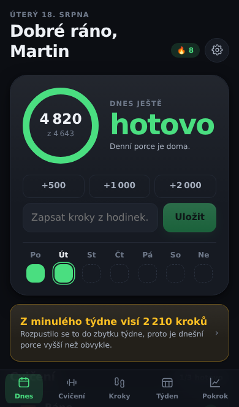
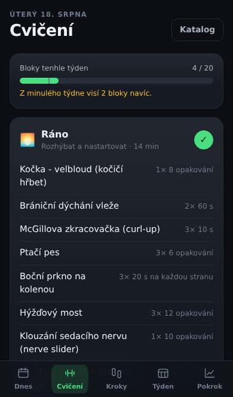
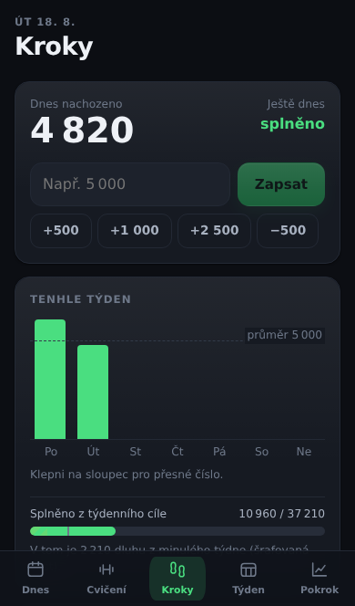
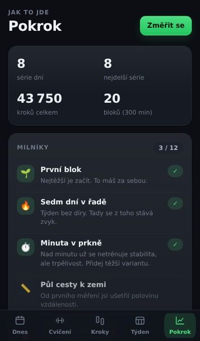

# Henry

Osobní PWA na to, aby ses hýbal. Kroky s týdenním dluhem, třikrát denně patnáct
minut cvičení, týdenní úkoly a notifikace, které chodí i když je appka zavřená.

Nasadíš si ji na svůj server (Raspberry, VPS) – appka i API běží z jedné adresy,
data leží u tebe a dovnitř se dostaneš přes Face ID.

Zaměření: **zpevnit střed těla, zhubnout, dostat se rukama na zem.**

| Dnešek | Cvičení | Kroky | Pokrok |
|---|---|---|---|
|  |  |  |  |

---

## Co to umí

**Úvodní průvodce.** Při prvním spuštění se Henry zeptá, kolik chodíš *teď*,
a první cíl postaví jen o desetinu výš. Cíl nastavený od stolu je nejrychlejší
cesta k tomu appku po týdnu smazat.

**Kroky s dluhem.** Týden je jeden hrnec. Co v pondělí nedochodíš, se rozpustí
do zbytku týdne – denní porce se prostě zvedne. Co zbude v neděli, se přenese
do dalšího týdne, ale **jen do stropu dvou denních dávek**. Zbytek se odpustí.

Ten strop je tam schválně. Bez něj by ti po dvou zkažených týdnech naskočila
nesplatitelná hypotéka a appku bys smazal. S ním je nejhorší možný scénář
„příští týden dva dny navíc“, což je 1,3násobek běžného objemu – přesně horní
hranice pásma, které tělo bez problémů unese.

Když se to i tak nakupí, je tu **bankrot**: jedním klepnutím dluh na nulu,
jednou za třicet dní. Není to podvod, je to pojistka proti tomu appku smazat.

**Cíl, který roste sám.** Začínáš na 35 000 krocích týdně (5 000 denně).
Po každém splněném týdnu se laťka zvedne o 3 500 (+500 denně), až na 49 000
(7 000 denně). Po nesplněném týdnu se nezvedne – zvyšovat nároky někomu, komu
to zrovna nevyšlo, je nejjistější způsob, jak ho odradit.

**Tři bloky po patnácti minutách.** Výchozí rozvržení, každý blok má jinou práci:

| Blok | Kdy | Co | Proč |
|---|---|---|---|
| Ráno | 7:15 | rozhýbání páteře, dýchání, McGillova trojka | ploténky jsou po noci nasáklé vodou, ohýbat se pod zátěží je pro ně ráno nejhorší – proto tu nejsou sedy-lehy |
| Poledne | 12:30 | core naostro, cvik na kyčle a dvě minuty kardia | přerušení sezení, které je ten hlavní problém; kardio proto, že hubne se z výdeje, ne z prkna |
| Večer | 20:00 | protahování se zaměřením na zadní stranu stehen | večer je rozsah pohybu největší a sval prohřátý |

**Rozvržení je jen výchozí.** Každou ze tří pozic v dni si pojmenuješ, dáš jí
ikonu, vybereš zaměření (rozhýbání / core / protažení / **kardio**) a délku
od 5 do 30 minut – nebo ji vypneš. „Cvičím jen večer, dvacet minut protahování"
je legitimní plán a appka se podle toho přepočítá včetně dluhu i notifikací.
Pozice zůstávají stejné i po přejmenování: visí na nich zápisy odcvičených
bloků a odkazy z notifikací.

Plán se každý den mírně obmění, kostra zůstává. Protažení hamstringů je každý
večer – rozsah roste z pravidelnosti, ne z toho, jak silně do toho jdeš.

Obtížnost se **nestřídá**, ta se posouvá: podle zvolené úrovně dostaneš prkno
na kolenou, plné prkno, nebo prkno s dotykem ramen – ale pokaždé to stejné.
Střídají se jen cviky, které jsou vzájemně zaměnitelné. Jinak by pestrost
znamenala jen to, že jeden den cvičíš snadnou variantu a druhý těžkou.

**46 cviků** s postupem, chybami, lehčí i těžší variantou, poznámkou, kdy to
nedělat – a u každého **kreslenou ukázkou provedení**, která se hýbe. Není to
video ani fotka: postavička je poskládaná ze souřadnic kloubů, takže celá sada
váží jednotky kilobajtů, funguje offline a vypadá stejně v tmavém i světlém
režimu. V seznamu se kreslí statická cílová poloha, v detailu a v přehrávači
se rozhýbe (a kdo má v systému omezený pohyb, dostane obrázek bez animace). Co se ti nelíbí nebo tě to bolí, vyřadíš a Henry to nahradí jiným.
Čtyři cviky s činkami jsou v katalogu kvůli týdennímu úkolu „posilovna“ –
do domácích bloků se nepletou.

**Série, která snese jeden špatný den.** Za každých sedm dní máš záchranu –
propadlý den ji spotřebuje, ale sérii neshodí. Teprve druhý propadlý den
v témže týdnu ji ukončí. Nemoc nebo služebku navíc označíš jako den odpočinku
a nepočítá se vůbec.

**Milníky** místo prázdných odznaků: první blok, sedm dní v řadě, 100 000 kroků,
minuta v prkně, půl cesty k zemi, dlaně na zemi. Odemykají se za věci, které
něco znamenají.

**Notifikace, které opravdu chodí.** Na iPhonu s appkou přidanou na plochu.
Maximálně čtyři se zvukem denně, noční klid, poslední místo v denním rozpočtu
je rezervované pro to důležité, a když konkrétní připomínku třikrát po sobě
ignoruješ, na dva dny se odmlčí.

**Kroky z Apple Health** přes Zkratku, která je jednou denně pošle na server.
Nebo si je zapíšeš ručně, appka funguje i tak.

**Pokrok** – váha, obvod pasu, kolik centimetrů ti chybí na zem, výdrž v prkně.

**Účet a synchronizace mezi zařízeními.** Přihlašuješ se **Face ID / Touch ID**
(heslo zůstává jako záchrana); data se drží na serveru, takže výměnu telefonu
přežijí a na notebooku vidíš totéž. Slučuje se **po záznamech**, ne přes celý
stav: ranní odškrtnutý blok z telefonu a odpolední zápis kroků z notebooku
přežijí oba. Server si po každé synchronizaci odkládá stav stranou, takže jde
vrátit i to, co si sám rozbiješ.

První účet si založíš při prvním otevření a tím se registrace zavře – kdo má
přijít potom, dostane od tebe pozvánku. V nastavení vidíš přihlášená zařízení
i nastavené klíče a kterékoli z nich můžeš odebrat.

**Týdenní úkoly si poskládáš sám.** Posilovna, bazén, dlouhá procházka, vážení,
dny bez alkoholu – u každého si nastavíš název, ikonu, kolikrát za týden,
jestli se nesplněné přenáší, poznámku i pořadí. Výchozí pětice je jen návrh
a nabídka hotových úkolů (pohyb, zdraví, návyky) je na dvě klepnutí. Vlastní
úkol jde napsat ručně a k výchozí sadě se dá kdykoli vrátit.

**Face ID místo hesla.** Účet se zakládá e-mailem a heslem, ale hned potom si
v nastavení zapneš klíč (passkey) a dál se přihlašuješ obličejem nebo otiskem –
i v appce spuštěné z plochy. Soukromý klíč nikdy neopustí telefon, server má
jen tu veřejnou polovinu, takže z ukradené databáze se přihlásit nedá. Žádný
Google ani Apple v tom nefiguruje: nikdo třetí se nedozví, kdy se do appky
díváš, a nemá jak ti přístup odstřihnout.

---

## Jak je to poskládané

```
app/       PWA (Vue 3 + Vite + TypeScript)
  src/lib/       výpočty: dluh, série, plán dne, slučování – čisté funkce s testy
  src/views/     obrazovky
  e2e/           testy, které appku proklikají v prohlížeči
server/    Node/Express: účty, synchronizace, notifikace, příjem kroků
Dockerfile Jeden obraz, ve kterém je appka i server
```

Server servíruje i appku, takže všechno běží z jedné adresy. Není to jen
pohodlí: přihlašovací cookie funguje čistě jen ze stejného původu a odpadá tím
celý CORS.

Data se zapisují v telefonu (pracovní kopie v `localStorage`, díky ní appka
funguje offline) a odtud tečou na server, který je slévá s tím, co přišlo
z jiných zařízení. Na serveru je **jeden SQLite soubor**: účty, data
uživatelů i provozní stav notifikací.

**Když je server zrovna nedostupný**, appka jede dál z místní kopie – zapisuješ
kroky, odškrtáváš bloky, všechno počítá. Po návratu spojení se to dorovná.
Nefunguje jen notifikace v naplánovaný čas při zavřené appce, a to není
nedodělek: na iOS neexistuje způsob, jak to udělat z prohlížeče.
Notification Triggers API se nikdy nedodělalo, Periodic Background Sync na iOS
není a časovač v service workeru nepřežije jeho ukončení (~30 s nečinnosti).
Notifikaci v konkrétní čas může spustit jedině něco, co v ten čas běží jinde.

---

## Rozjezd

Potřebuješ Node 22.5+ (kvůli vestavěnému `node:sqlite`).

```bash
cd server
npm install
npm run keys                    # vypíše VAPID klíče
cp ../.env.example ../.env      # a vlož do něj výstup předchozího příkazu
echo 'SECURE_COOKIES=off' >> ../.env   # bez HTTPS by cookie neprošla
npm run dev                     # http://localhost:8080

# appka (v druhém terminálu)
cd app
npm install
npm run dev                     # http://localhost:5173, API si proxuje na 8080
```

Otevři http://localhost:5173 a založ si první účet – registrace je otevřená,
dokud tam žádný není.

### Testy a kontroly

```bash
cd app
npm test          # výpočty, plán, slučování, úkoly a ukázky cviků (148)
npm run e2e       # e2e testy v prohlížeči (53) – projdou appku jako uživatel
npm run typecheck
npm run build
npm run screenshots  # přegeneruje obrázky v docs/screenshots

cd ../server
npm test          # účty, klíče, HTTP rozhraní, plánovač, slučování dat (156)
npm run typecheck
npm run build
```

E2E testy jedou proti produkčnímu buildu v mobilním rozlišení a kontrolují
celé toky: přihlášení heslem i klíčem, úvodního průvodce, zápis kroků, průchod blokem cvičení
včetně odpočtu, přenos dluhu, bankrot, měření, milníky, synchronizaci mezi
zařízeními i registraci service workeru. Běží i v CI
(`.github/workflows/ci.yml`).

---

## Nasazení

Jeden příkaz, jeden obraz – uvnitř je appka i server:

```bash
git clone https://github.com/Juryyy/Henry.git
cd Henry
cp .env.example .env    # a vyplň VAPID klíče (cd server && npm run keys)
docker compose up -d
```

Pak už jen veřejná HTTPS adresa (Tailscale Funnel zdarma a bez vlastní domény,
Cloudflare Tunnel, nebo Caddy na VPS) a první účet si založíš rovnou v prohlížeči.

**Chceš to jen vyzkoušet?** Nemusíš nic kupovat: `docker compose up` na
notebooku a `http://localhost:8080` projde úplně všechno včetně Face ID
(localhost je pro prohlížeč bezpečná adresa). Na telefon to dostaneš přes
Tailscale Funnel z toho samého notebooku. Postup i přehled, kde to nechat
běžet nonstop, je v [docs/nasazeni.md](docs/nasazeni.md).

**Návod krok za krokem je v [docs/nasazeni.md](docs/nasazeni.md)** – Raspberry
i VPS, včetně tunelů a řešení nejčastějších problémů.

> **Musí to běžet přes HTTPS.** Bez něj neprojde přihlašovací cookie, nejde
> service worker ani push, a iOS navíc odmítne self-signed certifikát
> s nicneříkající chybou.

### Přidání na plochu (iPhone)

1. Otevři adresu serveru v **Safari** (ne v Chromu – ten na iOS neumí přidat
   PWA tak, aby fungovaly notifikace).
2. Sdílet → **Přidat na plochu**.
3. Spusť appku **z ikony**, ne ze Safari, a přihlas se.
4. Nastavení → Účet → **Přihlášení přes Face ID** → *Nastavit na tomhle zařízení*.
5. Nastavení → Notifikace → **Zapnout notifikace**.
6. *Test ze serveru* – za chvíli to musí cinknout.

Bez kroku 2 a 3 push nefunguje a nejde to obejít: v Safari na kartě objekt
`Notification` na iOS vůbec neexistuje.

---

## Kroky z Apple Health

Návod krok za krokem je v **[docs/apple-health.md](docs/apple-health.md)**.

Stručně: Zkratka jednou denně přečte kroky z Health a pošle je POSTem na
`/api/ingest/steps`. Posílá vždycky poslední tři dny, protože HealthKit je
při zamčeném telefonu nečitelný a jeden den občas vypadne – takhle se to
příští den samo zahojí.

---

## Odkud jsou cviky

Katalog vychází z rešerše doporučení ACSM, prací Stuarta McGilla ke stabilizaci
páteře a metaanalýz k protahování. Několik čísel, která ovlivnila návrh:

- **Protahování**: rozsah pohybu roste nejvíc kolem 4 minut na svalovou skupinu
  a sezení, ~10 minut týdně; nad tím se nic navíc nezíská (Ingram et al.,
  *Sports Medicine* 2024, 189 studií).
- **Proč to zpočátku funguje**: prvních zhruba osm týdnů nepovoluje sval, roste
  tolerance k tahu (Weppler & Magnusson, *Physical Therapy* 2010). Trvalá změna
  délky svalu potřebuje zátěž, ne jen protahování – proto jsou v plánu i excentrické
  a plnorozsahové pohyby.
- **Na zem se dostaneš**: první měřitelná změna po ~4 týdnech, typicky 2–5 cm.
  Měř jednou za dva týdny, ne denně – rozsah kolísá o 3–5 cm podle denní doby.
- **Kroky**: 7 000 denně proti 2 000 odpovídá zhruba 47% nižší celkové úmrtnosti
  (*Lancet Public Health* 2025, 57 studií). Nad 7 000 se křivka už jen mírně ohýbá.
  Deset tisíc je marketingové číslo z japonského krokoměru z roku 1965.
- **Dohánění kroků**: koncentrovat týdenní objem je v pořádku – „weekend warrior“
  analýzy nenacházejí rozdíl proti rovnoměrnému rozložení. Limit není metabolický,
  ale tkáňový: skokový nárůst nad ~1,3násobek běžného objemu zvedá riziko přetížení.
  Odtud strop dluhu na dva dny.

**Tohle není lékařská rada.** U každého cviku je poznámka, kdy ho nedělat.
Když se objeví bolest vystřelující do nohy, brnění nebo necitlivost, nepřetlačuj
to a běž za fyzioterapeutem.

---

## Poznámky k bezpečnosti

- **Face ID (passkeys)** je hlavní cesta dovnitř. Server drží jen veřejný klíč;
  přihlášení je podpis náhodné výzvy, takže po drátě neletí nic, co by šlo
  odchytit a přehrát. Klíč je svázaný s doménou, takže ho nejde použít na
  podvržené stránce. Výzva platí pět minut a jen na jedno použití.
- **Hesla** se hašují scryptem s náhodnou solí. V databázi není nic, z čeho by
  šlo heslo získat. Heslo zůstává jako záchrana pro nové zařízení – klíč je
  vázaný na doménu a na telefon.
- **Sezení** žijí v `httpOnly` cookie – žádný skript se k nim nedostane –
  a v databázi jen jako otisk. `SameSite=Lax` znamená, že cizí web cookie
  k požadavku nepřipojí; to je zároveň obrana proti CSRF.
- **Změna hesla odhlásí ostatní zařízení.** Jinak by změna po prozrazení hesla
  nic neřešila.
- **Registrace se po prvním účtu zavře** a dál se dovnitř dá jen na pozvánku.
  Otevřená registrace na veřejné adrese je pozvánka pro kohokoli.
- **Přihlašování má strop pokusů** (deset za deset minut z jedné adresy), aby
  se heslo nedalo zkoušet hrubou silou.
- **Token pro Zkratku** je vázaný na účet, ukáže se jednou, ukládá se jen jako
  otisk a dá se zrušit bez změny hesla.
- **Klíč nejde nastavit cizímu účtu**: výzva se vydává přihlášenému a ověřuje
  se, že se vrátila od téhož. Klíče jednoho účtu nejsou vidět ani odebratelné
  z jiného.
- Ověření běží **před** parsováním těla požadavku, takže nepřihlášený požadavek
  nedonutí server alokovat paměť.
- Účty jsou od sebe oddělené na úrovni databáze a hlídají to testy – „uživatel
  A nesmí vidět data uživatele B" je věc, která se klikáním neobjeví.
- VAPID klíče vygeneruj jednou a nech je být. Přegenerování zneplatní všechny
  existující odběry.
- `.env` a `data/` do gitu nepatří (jsou v `.gitignore`).

---

## Data

V telefonu leží pracovní kopie v `localStorage`; appka díky ní funguje offline
a reaguje okamžitě. Tatáž data se drží i na serveru v SQLite, takže výměnu
telefonu přežijí.

Slučování je **last-write-wins po záznamech**: každý den, míra i úkol nese čas
poslední změny a novější zápis vyhrává. Dluhová kniha se schválně nepřenáší –
je odvozená z dnů a nastavení, takže si ji každé zařízení po sloučení spočítá
samo.

Smazané záznamy cestují jako náhrobek, jinak by je zastaralé zařízení vzkřísilo.

Stažená záloha (Nastavení → Data) je pojistka navíc – hodí se, když chceš data
mít i mimo server. Sedmidenní mazání úložiště, kterým Safari trestá běžné weby,
se na appky přidané na plochu nevztahuje.
